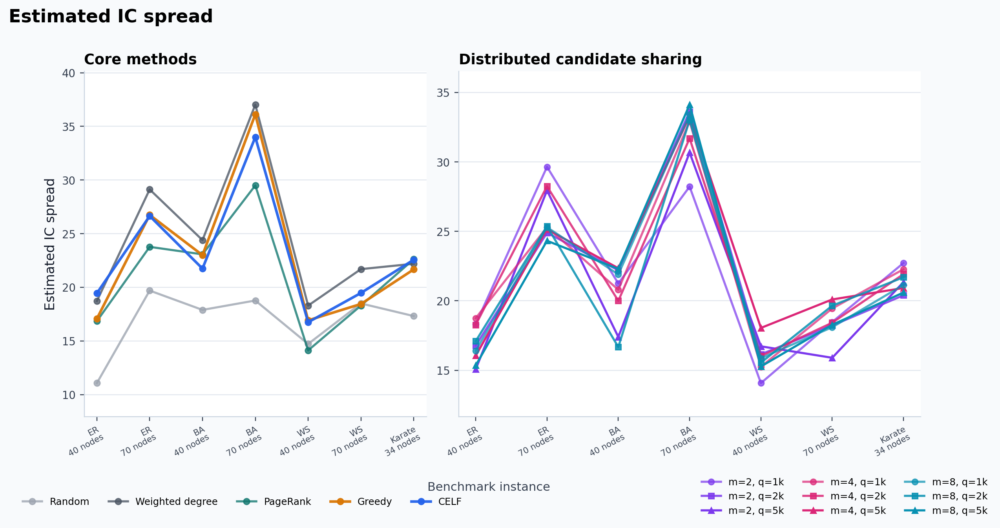
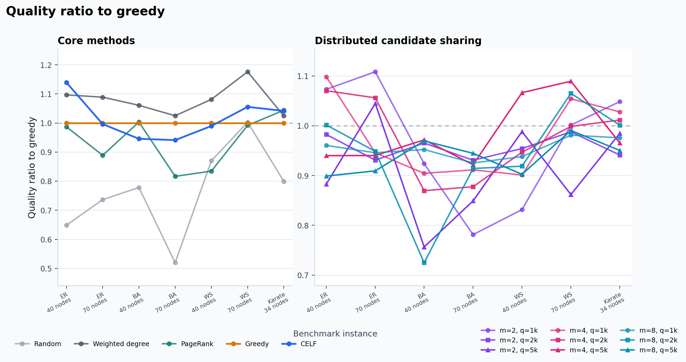
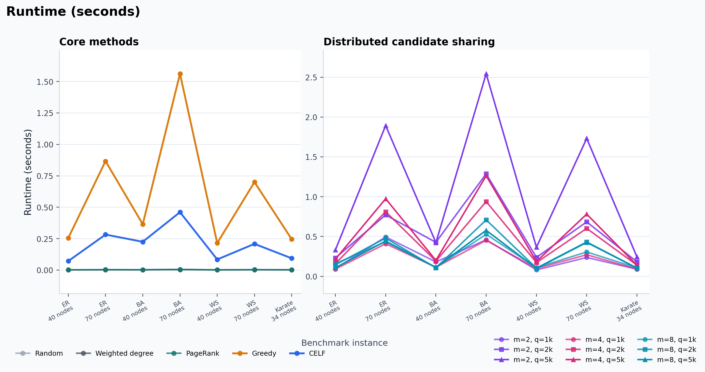
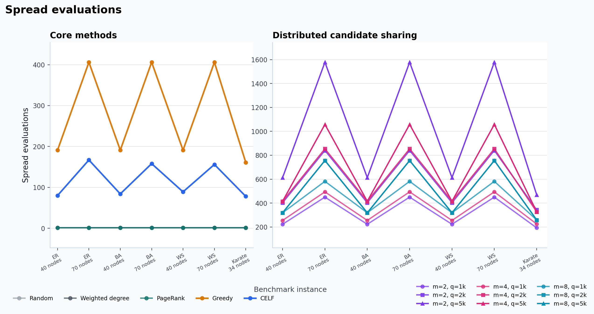
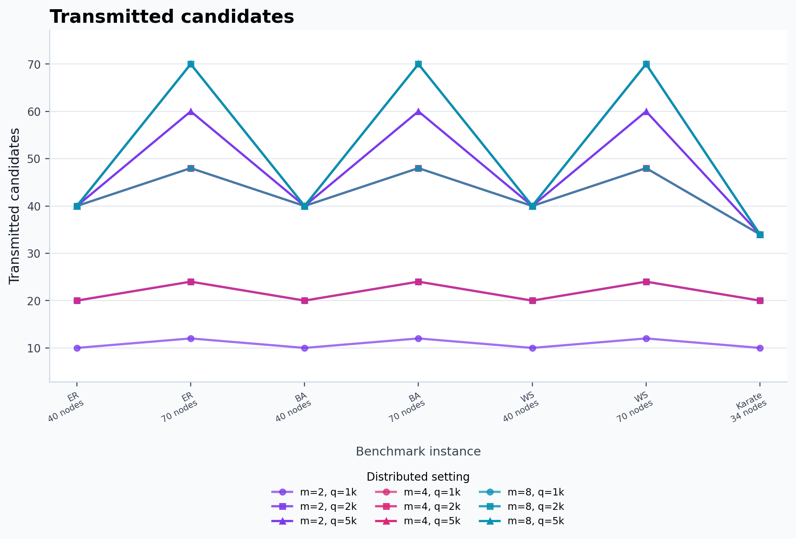

# CS240 Course Project

This repository contains the course project materials for **CS240: Algorithm
Design and Analysis, Spring 2026**.

## Project Topic

**Communication-Constrained Distributed Influence Maximization**

The project is based on **Topic 3: Influence Maximization**. It studies how
classical greedy approximation algorithms for monotone submodular maximization
can be used for modern network diffusion problems, and how solution quality
changes when centralized greedy selection is replaced by local greedy selection
plus limited candidate communication.

## Implemented Methods

- Random seed baseline
- Weighted out-degree baseline
- PageRank baseline
- Centralized Monte Carlo greedy under the Independent Cascade model
- CELF / lazy greedy with cached marginal-gain upper bounds
- GreeDI-style distributed greedy with local candidate budget `q`

## Project Structure

| Path | Description |
| --- | --- |
| `src/graphs.py` | Synthetic and small real-world graph generation with IC probabilities |
| `src/simulation.py` | Independent Cascade simulation and Monte Carlo spread estimation |
| `src/baselines.py` | Random, degree, PageRank, and fixed-seed-set evaluation baselines |
| `src/greedy.py` | Centralized Monte Carlo greedy and CELF/lazy greedy |
| `src/distributed.py` | GreeDI-style local candidate sharing and node partitioning |
| `src/results.py` | Shared `SelectionResult` and seed-set type definitions |
| `src/algorithms.py` | Compatibility export layer that re-exports all algorithms |
| `src/metrics.py` | Quality ratio, communication proxy, and marginal-gain helpers |
| `src/experiments.py` | End-to-end experiment runner |
| `src/plotting.py` | Figure generation |
| `src/graph_visualization.py` | Small-scale graph structure visualization |
| `tests/` | Lightweight unit tests |
| `outputs/` | Generated CSV results and figures |
| `references/` | Project reference papers |

## Where to Find the Code You Want

| If you want to change... | Open this file |
| --- | --- |
| IC diffusion logic or Monte Carlo spread estimation | `src/simulation.py` |
| graph types or propagation probability rules | `src/graphs.py` |
| random / degree / PageRank baselines | `src/baselines.py` |
| centralized greedy seed selection | `src/greedy.py` |
| CELF lazy-greedy priority-queue logic | `src/greedy.py` |
| distributed `m` partitions and local candidate budget `q` | `src/distributed.py` |
| experiment cases, metrics written to CSV, or `m/q` sweeps | `src/experiments.py` |
| plot list and figure formatting | `src/plotting.py` |
| small graph structure figures | `src/graph_visualization.py` |
| shared output fields such as spread/runtime/evaluations | `src/results.py` |

The old all-in-one import style still works through `src/algorithms.py`, but
new code should preferably import from the focused module it uses.

## Setup

Create and activate the virtual environment:

```powershell
python -m venv .venv
.\.venv\Scripts\Activate.ps1
```

Install dependencies and the local package:

```powershell
python -m pip install -r requirements.txt
python -m pip install -e .
```

## Run Experiments

```powershell
python src/experiments.py --seed 7 --simulations 40
```

This writes:

- `outputs/influence_maximization/influence_results.csv`
- `outputs/influence_maximization/figures/estimated_spread.png`
- `outputs/influence_maximization/figures/quality_ratio_to_greedy.png`
- `outputs/influence_maximization/figures/runtime_seconds.png`
- `outputs/influence_maximization/figures/spread_evaluations.png`
- `outputs/influence_maximization/figures/transmitted_candidates.png`

The default `--scale small` preset uses ER/BA/WS graphs with `n = 40, 70`, plus
the fixed 34-node Karate graph. Use `--scale large` for ER/BA/WS graphs with
`n = 50, 100, 200`; large results are written separately as
`outputs/influence_maximization/influence_results_large.csv` and
`outputs/influence_maximization/figures/*_large.png`. Synthetic graph sizes can
be overridden with `--sizes`, and `--no-progress` disables the progress bars.

Use `--output-dir SOME_PATH` only when you intentionally want a separate run
directory, for example for a quick smoke test.

The main distributed variables are:

- `m`: number of partitions, tested as `2`, `4`, and `8`
- `q`: local candidate budget, tested as `k`, `2k`, and `5k`

The main reported metrics are expected spread, runtime, number of spread
evaluations, distributed quality ratio relative to centralized greedy, and
transmitted candidate count.

The CSV contains both:

- `selection_estimated_spread`: the spread estimate used internally while an
  algorithm selected seeds.
- `estimated_spread`: a fair re-evaluation of the final seed set using a common
  evaluation seed, used for `quality_ratio_to_greedy`.

## Result Figures

The latest generated figures are stored under
`outputs/influence_maximization/figures/`.

The `comparisons/` subdirectory contains bar-chart comparisons across node
counts and methods for all reported metrics. The `graphs/` subdirectory contains
small-scale graph structure visualizations generated by
`src/graph_visualization.py`.

<table>
  <tr>
    <td></td>
    <td></td>
  </tr>
  <tr>
    <td align="center">Estimated IC spread</td>
    <td align="center">Quality ratio to centralized greedy</td>
  </tr>
  <tr>
    <td></td>
    <td></td>
  </tr>
  <tr>
    <td align="center">Runtime</td>
    <td align="center">Spread evaluations</td>
  </tr>
  <tr>
    <td colspan="2"></td>
  </tr>
  <tr>
    <td colspan="2" align="center">Transmitted candidates</td>
  </tr>
</table>

## Run Tests

```powershell
python -m pytest
```

If the global Python environment does not have the dependencies installed, use:

```powershell
.\.venv\Scripts\python.exe -m pytest
```

## Notes

The implementation intentionally focuses on a course-scale reproduction rather
than state-of-the-art systems. PaC-IM, IMM/RIS, GreediRIS, and recent
MapReduce/adaptive submodular algorithms are treated as related work and
possible optional extensions.
